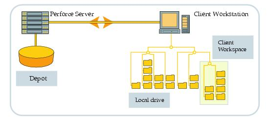

## Getting started with Perforce as a developer
  
  
If you have been working on software (or even hardware, what with all the layout designs, manuals and everything else; [_hardware is hard!_](https://www.androidauthority.com/google-pixel-hardware-pichai-interview-1120803/)), you would have encountered one or the other version control systems.  
The common ones in use are git, SVN, and of course, the infamous **perforce**.  
I have not used SVN, so will not be commenting on it.  
  
Centralized version control systems (CVCS) (like **perforce**) focus on files. The changes are recorded as _changes to files_, and each file is allocated a revision after each change.    
Distributed version control systems (DVCS) (like **git**) focus on sharing _changes as a whole_. Each change is recorded as a patch, or a diff file, which is then maintained in the local repository till the user deems it fit to merge on the deployable branch.  
    
  
************************************************************************************  

* ### [Perforce Architecture](https://www.perforce.com/perforce/doc.972/manual/2-concepts.html#:~:text=Perforce%20has%20a%20client%2Fserver,the%20server%20via%20TCP%2FIP.)  

   
Perforce has a client/server architecture, in which many computers, called clients, are connected to one central machine, the server. Each user works on a client; at their command, files they've been editing are transferred to and from the server. The clients communicate with the server via TCP/IP.  

  
From https://www.perforce.com/perforce/doc.091/manuals/intro/01_intro.html
  
The Perforce clients may be distributed around a local area network, wide area network, dialup network, or any combination of these. There can also be Perforce clients on the same host as the server.  
  

************************************************************************************  

**Advantages** perforce has over git is:  
 * the support you get, because of it being a licensed tool  
 * Working with large files and huge code repositories (or depots) is much easier with perforce, since the latest version of all files is on the server at all times, and you can check out any file at any time and start working (**Remember, perforce focuses on _files_**)  
  
**Disadvantages** of perforce:  
 * I have not seen any disadvantage with perforce for normal work flow with a limited number of developers, apart from the fact that it is **_supremely_** unintuitive. The concepts of changelists, shelving, syncing (need I go on?!) are really daunting to a first time user (like I was(am!), still working to get the hang of it!).  
  

************************************************************************************  

But all the idiosyncrasies aside, perforce does its job of version control really well. It just needs a little bit of push to start getting your hands dirty, and a **_LOT_** of practice!   
  
  
  
So I have put together a few basic commands and a sample workflow based on my experience, might help others struggling with this heavyweight of the version control world!  
  
Let us go over a sample workflow for perforce, I will be explaining the commands as we go through.  All commands can be found in the perforce official manuals, I have tried to provide the most commonly used arguments for each one.
  
  
*************************************************************************************  
  
* ### **Create a workspace**  

Let us create a workspace first. A workspace is a mapping from the server to your machine; which tells the perforce server to track all the files and let you know when the files differ between the server and your local copy.  
  
>**mkdir my_workspace**    
>**cd my_workspace**    
>**export P4CLIENT=my_workspace**  
#this line tells the perforce server that you want to create a new client (or workspace). At this point, perforce has created the client, but has no mappings     
>**echo -n "P4CLIENT=my_workspace" > .p4config**    
#.p4config is the file which p4 uses to store all the client specific information in environment variables. You can also put the P4PORT, P4USER and other variables in this file. Ensure that you have set the P4CONFIG variable to .p4config before this step.    
>**p4 client**  
#Check this file, it contains all the information about the client you have created, save this, and we are good to go!    
  
*************************************************************************************  

* ### **Sync the workspace to the depot**  

Now let us sync the files we need to work on. Typically you would need one or more directory and their subdirectories, or maybe even a single file. The way we do this is to bring the files in our local workspace _in sync_ with the **_depot_**.

What do we mean by a depot, you ask? The perforce server manages shared file repositories, or depots. Depots contain every revision of every file under Perforce control. Files in a depot are referred to as depot files or versioned files.
  
>**p4 sync //sample_depot/folder_of_interest/...**  
#This copies the folder_of_interest and all its subdirectories recursively into your local workspace. Remember, since the server is the central repository, the files you get would be the latest ones on the server.   
  
You can also sync to a perforce _label_, which is similar to a git tag, a snapshot in time of the file _versions_ at the time of the label creation.  
>**p4 sync //sample_depot/folder_of_interest/...@labelname**  
  
Or maybe you are interested in the version up to when a particular _changelist_ was submitted, which tracks the files being changed, and marks them with a _revision number_!  
>**p4 sync //sample_depot/folder_of_interest/...@changelist**   
  
After the sync is complete, assume the directory structure is as follows:  
* folder_of_interest  
  * file1  
  * file2  

*************************************************************************************  

* ### **Making changes**  
Now that we have the files, we can relax a bit, but where's the fun in that? Let us change the files around!  
Let us edit the file1, delete file2 and add a new file3. But till now, perforce does not know what we have done. So what is the next step?  
  
Now we need to let perforce know that we have made these changes.  
>**p4 edit file1** #opens file1 for edit, tells perforce we have _modified_ this file  
>**p4 delete file2** #opens file2 for delete, tells perforce we will be _removing_ this file  
>**p4 add file3** #opens file3 for add, tells perforce we will be _adding_ this file  
  
There is another way to open these files  
>**p4 reconcile**  
#This goes through your mapped files (also called files in your _client view_), and tracks all changes done in the workspace.  
No need to open files for edit before modifying, adding or deleting. p4 will compare our version to the depot version and open files for edit, add or delete correctly.  
  
From the manual,  
The p4 reconcile command finds unopened files in a client's workspace and detects the following three types of inconsistencies between your workspace and the server:  
a) Files present in the depot, present in your have list, but missing from your workspace. By default, these files are then opened for delete.  
b) Files present in your workspace, but missing on the depot. By default, these files are opened for add.  
c) Files modified in your workspace that are not open for edit. By default, these files are opened for edit.  

*************************************************************************************  

* ### **Check and verify the changes made by you**  
  
>**p4 opened**  
#Shows all the files opened by perforce. If you forgot step 3, p4 will not know you have made any changes, **it will NOT track these files** and you will not see any files here. Remember, perforce is centrally controlled, which means you have to tell the server what you are changing in your local copy.  
  
You should see an output similar to the following  
//sample_depot/folder_of_interest/file1#3 - edit default change (text+x)  
//sample_depot/folder_of_interest/file3#1 - add default change (text)  
//sample_depot/folder_of_interest/file2#2 - delete default change (text+x)  
  
>**p4 diff**  
#It will show the changes made in modified files. Added/deleted files will not appear here.  
>**p4 diff -du**  
#Shows the diff in the unified format, can be even used as a patch if required, with minor modifications.  
  
If you find you have made changes to (or added, or deleted) a file in error, do not worry! Use **p4 revert (filepath/filename)** to revert the change, and the file will no longer be open.     

*************************************************************************************  

* ### **The concept of Changelists** (or _CLs_, as they shall be referred to as henceforth)  

Okay, now that we have made the changes, let us consolidate these and store the new version of these files in a **_numbered changelist_**. Right now, your changes are in the **default** changelist. perforce uses the **default** changelist to store your changes, but it is not useful if you want to share the changes without submitting it (use **p4 submit** to submit the default changelist, but it can be dangerous to do so if you are working in collaboration with others).  
  
>**p4 change** #This command creates a numbered CL and puts your changes there.  
  
This will open an editor (vi/vim by default), update the description there and save the file, you are done! You can also see the affected files at the bottom.  
You should see something like  
_Change 12345 created with 3 open file(s)._  
  
Congratulations, you have created  a _pending_ changelist now! This is a temporary changelist, which is not yet submitted to the main repository, but you can use it to track the changes done till this point.  
  
Let us check the CL details now  
>**p4 describe 12345** #This shows you the details you added with **p4 change**, you can see the changed/affected files.  
  
Now this changelist will also be visible in the P4V GUI, if you are using P4V.  
  
  
From here, you can submit the changelist to the server using  
>**p4 submit -c 12345** #This will submit the CL#12345 to the server  
  
If you have no plans of submitting this change right now, we should **shelve** the files (similar to creating a local commit in git). If you do not do this, the pending changelist would keep tracking your workspace, and any changes made to the open files would reflect in the CL as well.   

*************************************************************************************  

* ### **Shelving the CL**  

As discussed above, a shelved CL is a CL which is a snapshot of the changes you have made in the workspace. After shelving the changelist, you can modify the workspace all you want, the changelist will remain intact, and can be _unshelved_ at any point, by any other user on their machine. This is useful for sharing your changes with others in a team.  
  
>**p4 shelve -c 12345**  
#Shelved CL#12345. These changes are now shelved and are now independent of your workspace status.  
  
You can check the shelved CL with  
>**p4 describe -s -S 12345**  
#describes the shelved CL#12345. Check for yourself, the CL description does not change even when you reset the workspace.  
  
Other users (or you yourself, if you accidentally (or knowingly!) reset your workspace or make other changes) can pick the changes (or _unshelve_ the changelist)  
>**p4 unshelve -s 12345**  
#Replaces, adds or deletes file in the workspace as dictated by the CL#12345.  
  
>**p4 unshelve -f -s 12345**  
#unshelves file into the workspace from shelved files in pending CL#12345, when it contains added files  

>Note: "As a best practice, use the -f option to unshelve a shelf that has added files."  
From "https://www.perforce.com/manuals/v18.1/cmdref/Content/CmdRef/p4_unshelve.html"  
  
*************************************************************************************  
  
* ### **Check CLs for a particular user**  
  
>**p4 changes -u (USERNAME)**  
#This lists all pending and submitted changelists for the user.  
  
>**p4 changes -u (USERNAME) -s shelved**  
#List all shelved CLs for username, note that the CL is still _pending_, it is not yet submitted!  

*************************************************************************************  
  
* ### **Deleting a changelist**  

To delete a numbered changelist (you **cannot** delete the default changelist, you just have to revert the open files in that case)  
  
>**p4 shelve -d -c 12345** #delete the shelved CL#12345  
  
>**p4 change -d 12345** #delete pending CL#12345  

*************************************************************************************    
  
* ### **Moving files across changelists**  
  
>**p4 reopen -c 12345 (filepath/filename)**  
#Move this file to changelist#12345 (12345 can be replaced by "default" if you want to move the files to the default changelist)  

*************************************************************************************      

* ### **Differences in perforce labels**  

This has been taken verbatim from [this perforce community article](https://community.perforce.com/s/article/3429), I don't think I can explain it better.  

Assuming that label1 is released earlier than label2; and the client view (the mapping of the tracked files) has not changed,  
>p4 changes -m1 @label1  
#This gets the last CL submitted for this label, say this is 200  
>p4 changes -m1 @label2 #and say this is 250  
>p4 changes //labelview/...@201,@250 #gives the list of CLs  
  
You can go through the complete article for the finer details.  
  
*************************************************************************************      
  
This should be enough to get you started as a beginner, email me at r.ramanbits@gmail.com to let me know if you have any issues, or if you want to suggest edits/additions, or if you just want to discuss something!  
  
  
  
Happy Perforcing!!  